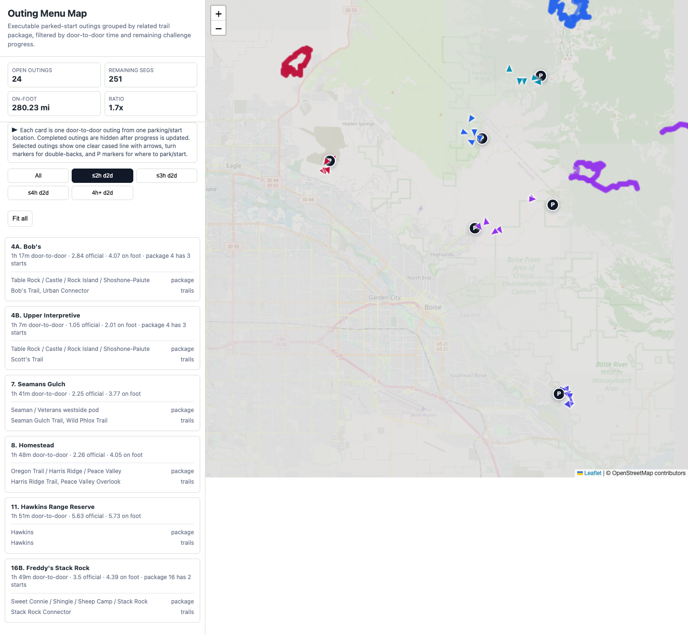

# Boise Trails AI

Route planning, progress simulation, and retrospective analysis for the Boise Trails Challenge.

The current work is focused on the 2026 on-foot challenge. The goal is not just to
draw lines that cover every official segment. The goal is to produce a practical
outing menu that answers the question Scott will actually have during the
challenge:

> I have a fixed amount of door-to-door time today. Where should I park, what
> should I run, how do I get back to the car, and what official segments does
> that knock out?

That means this repo treats route planning as a logistics problem:

- official challenge segments count only when completed end-to-end in one
  on-foot activity
- ascent-only segments must be traversed in the required uphill direction
- every normal outing must return to the parked car unless a shuttle/drop-off
  variant is explicitly labeled
- connector trails and public roads are allowed, but they are reported as extra
  mileage, not challenge progress
- elapsed time matters because kids, school pickups, work, and other hard stops
  often matter more than theoretical route purity
- the plan must adapt as segments are completed, so completed outings disappear
  from the current menu instead of remaining in a static month-long schedule

## What Happened Last Year

The 2025 public history rollup records Scott's result as **41.82% / 68.89 mi /
rank 491** against a final public target of **245 segments, 98 trails, and
164.73 official miles**. The preserved local 2025 planner input disagrees with
that final public target: it used **247 segments, 100 trails, and 169.354 mi**.
That mismatch is one of the reasons the 2026 workflow now locks source data by
year and records pull dates.

The bigger lesson from 2025 was not just source drift. The old planner could
generate many route fragments and GPX files, but it did not behave enough like a
human trail plan. It over-optimized mathematical coverage, produced too many
small errands, and did not make it easy to answer whether a proposed run was
worth doing from the standpoint of parking, elapsed time, return-to-car logic,
and enjoyment of actual trail loops.

The 2025 artifacts are still useful as a failure baseline:

- stale or preliminary official data can make a "complete" plan incomplete
- global optimizer output can look valid while becoming car-hop heavy
- minimizing drive starts alone can be wrong if it adds too much deadhead running
- tiny segment pickups should usually be absorbed into real trail-system loops
- the useful product is a rerunnable outing menu, not a one-time static calendar

## How 2026 Is Going

The 2026 official pull from 2026-05-04 is the current source of truth:

- challenge window: 2026-06-18 through 2026-07-18, America/Boise
- official on-foot trails: **101**
- official on-foot segments: **251**
- official on-foot distance: **164.43 mi**
- direction rules: **228 bidirectional**, **23 ascent-only**

The 2026 planner has moved through several stages:

1. **Coverage foundation.** Load the official 2026 trail/segment data, preserve
   direction rules, and validate that generated candidates cover all official
   segment IDs.
2. **Execution simulation.** Treat each candidate as a full outing: drive to a
   trailhead, park, access the official trail, run the official/connector/road
   route, return to the same car, and drive home.
3. **Calendar stress tests.** Prove that 100% completion is technically
   schedulable, while exposing when the result is too car-hop heavy or too
   physically large.
4. **Route-block redesign.** Replace dozens of small segment errands with
   recognizable trail-system outings, keeping small mop-ups only when geography
   or the single-car constraint justifies them.
5. **Outing-first map/menu.** Make the review surface match real usage: filter
   outings by door-to-door time, show where to park, show route direction with
   arrows, and hide outings that are already complete.

The important planning progression so far:

| Stage | Result | Interpretation |
| --- | ---: | --- |
| Full-clear stress test | 251/251 segments, 164.4 official mi, about 336 on-foot mi, 60 executable units | Proved coverage, but repeated the 2025 failure mode of too many fragments and too much overhead. |
| Block/combo route pass | 251/251 segments, about 308.6 on-foot mi, 29 route components | Better route grouping, fewer tiny errands, still too many multi-start packages. |
| Hybrid human-loop pass | 251/251 segments, about 280.2 on-foot mi, 25 route components, 1.70x on-foot/official ratio | Current best route-experience surface. It accepts splits when a single mega-loop would be worse. |
| Package 16 manual review | Sweet Connie/Shingle/Sheep reduced from a 36.5-mile Hawkins placeholder to two lower-access outings totaling about 27.2 on-foot mi | Example of the intended refinement loop: demote bad generated outings to manual design areas, then feed better candidates back in. |

The current posture is: the route/menu/map system is useful for field testing,
but day-of use still requires current Ridge to Rivers conditions, signage,
closures, and water/logistics checks.

## Recent Field Tests

Field tests are how the planner gets hardened against real trail use. They are
public, sanitized notes: no exact home origin, no raw Strava payloads, and no
private dashboard data.

Recent logs:

| Date | Test | Planned outing | Result | Planner learning |
| --- | --- | --- | --- | --- |
| 2026-05-06 | [Pre-challenge test 02](years/2026/field-tests/pre-challenge/2026-05-06-test-02/) | Harrison Hollow cue micro-test, or `Scott's Trail` only if the window expands to about 90 min | Planned: one-hour door-to-door validation window, not a full completion attempt. | The current menu has no true <=60 min full outing; the field packet should support timeboxed validation without falsely implying official segment credit. |
| 2026-05-05 | [Pre-challenge test 01](years/2026/field-tests/pre-challenge/2026-05-05-test-01/) | `1B. Harrison Hollow` | Door-to-door 2:25-4:24 PM; 4.74 mi Strava run; likely completed 10/12 planned segments; actual distance was 0.95 mi shorter than planned. | `Who Now Loop Trail 2` was likely missed, and the 96-min estimate was too aggressive: the corrected elevation/wayfinding model puts the old full outing near 2h21 p75. Phone cues now need signpost language and cleaner Nav/Cue/Audit GPX exports. |

[View all field-test logs](years/2026/field-tests/)

## Active Work

- Current year: `years/2026/`
- Current operating instructions: `AGENTS.md`
- Current research bundle scratch area: `projects/`
- Public field-test log: `years/2026/field-tests/`
- Daily planning/proof log: `years/2026/notes/daily-work-log.md`
- Credentials stay local in `credentials/` and are never archived into shareable bundles.

## How To Review The Current Plan

The normal review flow is intentionally map-first, but all public and private
interfaces should point to the same field-menu payload.

Canonical field-menu data:

```text
years/2026/outputs/private/2026-outing-menu-map-data.json
```

That JSON is the source for the private browser map, written outing menu, phone
field packet, and GPX exports. The committed public-safe copy is:

```text
outing-menu-map-data.json
```

1. Generate or refresh the private outing map:

   ```bash
   python years/2026/scripts/human_loop_plan.py
   ```

   This writes the canonical data, map, and written menu together:

   ```text
   years/2026/outputs/private/2026-outing-menu-map-data.json
   years/2026/outputs/private/2026-outing-menu-map.html
   years/2026/outputs/private/2026-outing-menu.md
   ```

2. Open the private local map:

   ```text
   years/2026/outputs/private/2026-outing-menu-map.html
   ```

3. Filter by available door-to-door time and pick an executable parked-start
   outing. The map card should show:

   - where to park/start
   - official miles and total on-foot miles
   - estimated door-to-door time
   - route direction and out-and-back/return arrows
   - mid-route car-pass / bailout points when the route comes back near the car
   - verified water locations, or a clear "no verified water" note
   - the package/context this outing contributes to
   - remaining official segments after current progress is applied

4. Use the written companion when you want a skimmable list:

   ```text
   years/2026/outputs/private/2026-outing-menu.md
   ```

5. Generate the phone field packet before field testing:

   ```bash
   python years/2026/scripts/export_mobile_field_packet.py
   ```

   This reads the canonical field-menu data first, then writes an installable
   mobile PWA plus three GPX flavors per runnable parked-start outing:

   ```text
   docs/field-packet/index.html
   docs/field-packet/field-tool-data.json
   docs/field-packet/manifest.webmanifest
   docs/field-packet/service-worker.js
   docs/field-packet/gpx/navigation/*.gpx
   docs/field-packet/gpx/cues/*.gpx
   docs/field-packet/gpx/audit/*.gpx
   docs/field-packet/gpx/all-field-packet-gpx.zip
   ```

   The phone packet intentionally skips manual-hold routes and strips private
   local paths/home-origin details. Use the Nav GPX for in-field navigation;
   it keeps the true track line plus parking/return and sparse cue waypoints.
   Cue GPX and Audit GPX are still generated for debugging, but the phone UI
   only exposes the Nav GPX by default. Use the phone card for parking, full
   car-to-car turn-by-turn cues, p75/p90 door-to-door time, ascent, car-pass /
   water logistics, ascent-only notes, return-to-car instructions, local
   progress, and the "best today" option for the selected door-to-door time
   window. On iPhone, open the page in Safari and
   use Share -> Add to Home Screen. After the first full load, the app caches
   the cards, manifest, field-tool data, icons, GPX files, and all-GPX zip for
   offline backup. Completion state is stored only in local browser storage.

6. After a field run, export and review progress:

   - On the phone packet, tap `Export progress`.
   - Edit the exported JSON before using it if any planned segment was missed;
     add those official ids to `missed_segment_ids`.
   - Run the planner-side progress report:

     ```bash
     python years/2026/scripts/field_progress_report.py \
       --progress-json /path/to/boise-trails-progress.json
     ```

   This writes:

   ```text
   years/2026/outputs/private/progress/field-progress-latest.json
   years/2026/outputs/private/progress/field-progress-latest.md
   ```

   The report produces a `private_state_patch.completed_segment_ids` list and
   says whether the current field menu still covers every remaining official
   segment. Review the activity evidence before merging that patch into
   `years/2026/inputs/personal/2026-planner-state.private.json`.

   To regenerate the phone packet from reviewed exported progress without
   editing private state yet:

   ```bash
   python years/2026/scripts/export_mobile_field_packet.py \
     --progress-json /path/to/boise-trails-progress.json
   ```

   To re-check whether the selected certified profile still has a completion
   path after reviewed progress:

   ```bash
   python years/2026/scripts/field_recertification_report.py \
     --progress-json /path/to/boise-trails-progress.json
   ```

   This writes `years/2026/outputs/private/progress/field-recertification-latest.*`.
   The default mode is fast: it verifies the certified baseline is still loaded,
   the remaining field menu covers every remaining official segment, and the
   remaining certified calendar has enough future dates. Use
   `--run-heavy-optimizer` for the slower generated-candidate set-cover rerun.

7. Audit the generated field tool before treating it as current:

   ```bash
   python years/2026/scripts/field_tool_completion_audit.py
   ```

   This checks the phone packet against the field-use contract: canonical
   source hash, certified 251/251 baseline, time filters, parked starts, Nav
   GPX presence/validation, turn cues, official segment coverage, p75/p90 time,
   DEM effort, progress export, recertification status, and public-safety
   redaction. It writes:

   ```text
   years/2026/checkpoints/field-tool-completion-audit-2026-05-06.json
   years/2026/checkpoints/field-tool-completion-audit-2026-05-06.md
   ```

Public-safe copies are committed at the repo root so GitHub visitors can find
them immediately:

```text
index.html
outing-menu-map-data.json
outing-menu-map.html
outing-menu.md
outing-menu-map.png
docs/field-packet/index.html
```



The same sanitized artifacts are also kept under
`years/2026/outputs/examples/` for year-scoped archival. They are generated from
the private map/menu with local private output paths redacted:

```bash
python years/2026/scripts/export_example_map.py
```

The example map/data are useful for reviewing the UI and route-card behavior,
but the private canonical data is the one that adapts to Scott's actual progress
and private planning origin.

## Personal State

Planner outputs are only a personalized plan when they are run with a real personal state file.

The committed starter file is:

- `years/2026/inputs/personal/2026-planner-state.example.json`

That file is safe to reuse and commit. Its pace and availability defaults are based on Scott's prior challenge-window history, so they are useful starter assumptions for another Boise runner, but they are not a substitute for that user's own Strava/history and calendar constraints.

For a real user, copy the example to an ignored private state file:

```bash
cp years/2026/inputs/personal/2026-planner-state.example.json \
  years/2026/inputs/personal/2026-planner-state.private.json
```

Then fill in:

- home or planning-origin label plus `origin_lat` / `origin_lon`
- `completed_segment_ids`, `blocked_segment_ids`, and `blocked_trail_names`
- `pace_min_per_mile`, ideally from Strava segment efforts or activity history
- weekday/weekend availability, rest cadence, acceptable same-day inter-trailhead drive, and target completion level
- hard-stop constraints such as school pickups, kids, work blocks, and whether split starts are preferred when they save elapsed time
- trailheads or public-road classes to avoid

Private state files matching `years/*/inputs/personal/*.private.json` are ignored by git. Keep exact home addresses there, not in committed docs or shareable outputs.

Run the planner with a private state file:

```bash
python years/2026/scripts/personal_route_planner.py \
  --state years/2026/inputs/personal/2026-planner-state.private.json
```

If you are onboarding another user without their own history yet, use the example defaults as a temporary baseline and label the result as an assumption-based sweep, not their final plan.

## Personal Plan Review

The current route-experience review file is:

- `years/2026/outputs/private/route-blocks/human-loop-plan-v1.md` - current user-facing loop/block plan, with route blocks classified as primary loops, accepted splits, or necessary grinders.
- `years/2026/outputs/private/2026-outing-menu-map-data.json` - canonical executable field-menu data. The browser map, written menu, phone field packet, and GPX exports should all be generated from this payload or its sanitized public copy.
- `years/2026/outputs/private/2026-outing-menu-map.html` - the single map file to load in a browser; it shows executable outing cards with door-to-door time filters, parking, route lines, progress-aware hiding for completed segments, selected-outing car-pass/water logistics, official segment direction cues, connector/return notes, and an isolated map line for screenshots.
- `years/2026/outputs/private/2026-outing-menu.md` - written companion to the map; one row per executable parked-start outing, grouped by door-to-door time bucket, with park/start, official miles, on-foot miles, remaining segment count, package context, and trails.
- `docs/field-packet/index.html` - phone-first PWA generated from the current outing map; each runnable outing has a Nav GPX link, parking navigation link, compact run card, full car-to-car turn-by-turn cues, car-pass/water logistics, local completion controls, and return-to-car notes.
- `docs/field-packet/field-tool-data.json` - public-safe data contract behind the phone tool: certificate summary, 60/90/120/180/240/360 minute filters, route rows, segment ids, parking, GPX hrefs, and validation status.
- `years/2026/outputs/examples/2026-outing-menu-map.example.html` - sanitized shareable example of the selected-outing map/card UI. It is generated from the private map with local private output paths redacted.

The current calendar/runbook fallback is:

- `years/2026/outputs/private/2026-personal-ideal-plan.md` - day-by-day runbook.

The runbook proves full single-car coverage against the current graph, but it is still car-hop heavy. Prefer the human loop plan when reviewing whether the routes feel like real outings.

Supporting review artifacts:

- `years/2026/outputs/private/route-blocks/block-first-plan-v1.md` - route-block review used to replace car-hop fragments with coherent trail outings.
- `years/2026/outputs/private/route-blocks/block-combo-route-pass-v1.md` - improved route pass that combines compatible same-block components while preserving full coverage.
- `years/2026/outputs/private/route-blocks/block-hybrid-route-pass-v1.md` - current best route-selection pass; globally chooses natural block routes and combo components while penalizing cross-block sweeps.
- `years/2026/outputs/private/route-blocks/block-hybrid-day-package-pass-v1.md` - current best route-package review surface; packages the improved hybrid pass into trail-system blocks.
- `years/2026/outputs/private/route-blocks/block-combo-day-package-pass-v1.md` - combo block-day review surface retained as comparison evidence.
- `years/2026/outputs/private/route-blocks/block-day-package-pass-v1.md` - current block-day review surface; groups the validated route components into trail-system packages so small segments are reviewed as absorbed pieces, not standalone errands.
- `years/2026/outputs/private/route-blocks/block-assembled-route-pass-v1.md` - diagnostic one-route-per-block assembly pass; useful evidence, but not a final plan because it currently increases total on-foot mileage.
- `years/2026/outputs/private/route-blocks/final-route-completion-audit.md` - explicit audit of whether the current artifacts satisfy the final normal-human route objective.

Older diagnostic scripts can still write comparison maps if explicitly asked, but the normal review flow maintains one browser target: `years/2026/outputs/private/2026-outing-menu-map.html`.

To reset testing back to a clean challenge-start state, use:

- `years/2026/notes/challenge-start-reset.md`

The repeatable reset command is:

```bash
python years/2026/scripts/reset_challenge_start.py
```

In short: clear `completed_segment_ids` in the ignored private state file, clear or deliberately preserve real current closures in the blocked fields, regenerate the full private route/menu/map chain, and confirm `block-hybrid-day-package-pass-v1-map-data.json` has empty `progress.completed_segment_ids` and `progress.blocked_segment_ids` lists. The command writes an audit record at `years/2026/outputs/private/reset/challenge-start-reset-latest.json`.

Regenerate the block-first review after changing the route-block definitions or selected runbook:

```bash
python years/2026/scripts/route_block_planner.py \
  --blocks-json years/2026/inputs/personal/2026-route-blocks-v1.json \
  --runbook-json years/2026/outputs/private/2026-personal-ideal-plan.json
```

Generate the current graph-candidate route pass:

```bash
python years/2026/scripts/block_route_candidate_pass.py \
  --plan-json years/2026/outputs/private/personal-route-menu.json \
  --blocks-json years/2026/inputs/personal/2026-route-blocks-v1.json
```

Generate the improved combo route pass:

```bash
python years/2026/scripts/block_combo_route_pass.py
```

Generate the route-package review surface:

```bash
python years/2026/scripts/block_day_packager.py
```

Generate the route-package review surface from the improved combo pass:

```bash
python years/2026/scripts/block_day_packager.py \
  --route-pass-json years/2026/outputs/private/route-blocks/block-combo-route-pass-v1.json \
  --basename block-combo-day-package-pass-v1
```

Generate the hybrid route pass and package review surface:

```bash
python years/2026/scripts/block_hybrid_route_pass.py
python years/2026/scripts/block_day_packager.py \
  --route-pass-json years/2026/outputs/private/route-blocks/block-hybrid-route-pass-v1.json \
  --basename block-hybrid-day-package-pass-v1
```

Generate the user-facing loop/block route plan:

```bash
python years/2026/scripts/human_loop_plan.py
```

That command writes the single browser map at `years/2026/outputs/private/2026-outing-menu-map.html`.
It also writes the canonical field-menu data at
`years/2026/outputs/private/2026-outing-menu-map-data.json`; do not regenerate
the phone field packet from an upstream route-block artifact that has not been
promoted into this canonical file.

Export a sanitized example copy of the canonical map for committing or sharing:

```bash
python years/2026/scripts/export_example_map.py
```

Generate the one-route-per-block diagnostic assembly:

```bash
python years/2026/scripts/block_route_assembler.py
```

Audit whether the current route artifacts are final-quality:

```bash
python years/2026/scripts/final_route_completion_audit.py
```

## Archive

Pre-2026 code, tests, configs, docs, generated outputs, local virtualenv/cache files, and old scratch artifacts were moved to:

- `archive/legacy-root-2025/`

Historical year data and retrospective baselines were moved to:

- `archive/years/`

Use archive paths for retrospectives and model-comparison work. New route planning, code, experiments, and generated outputs should start under `years/2026/`.
